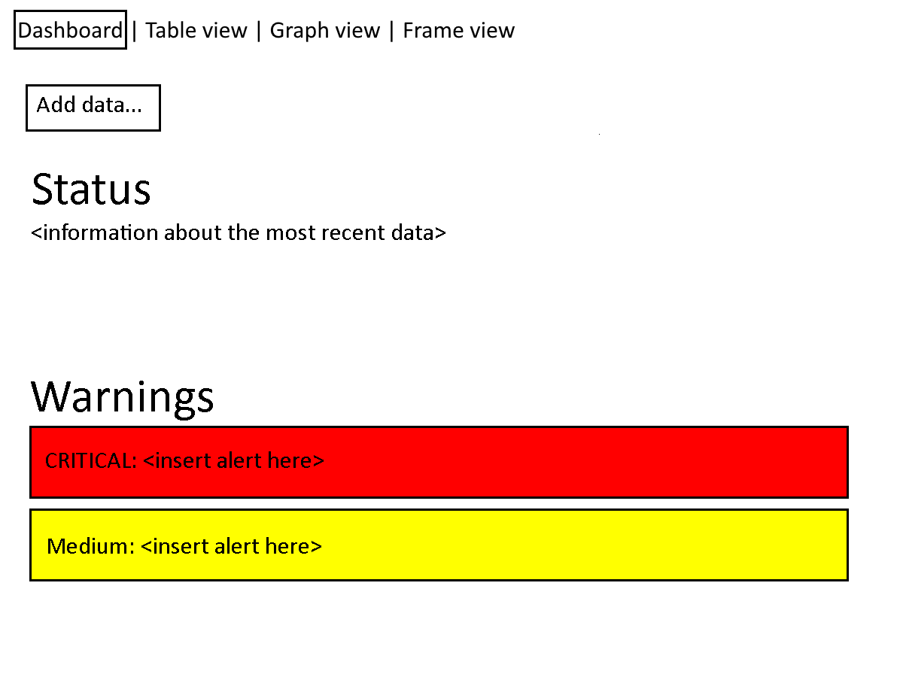
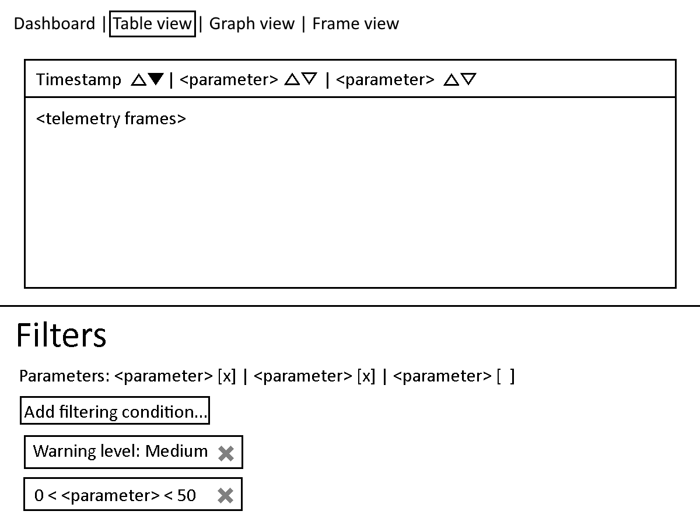
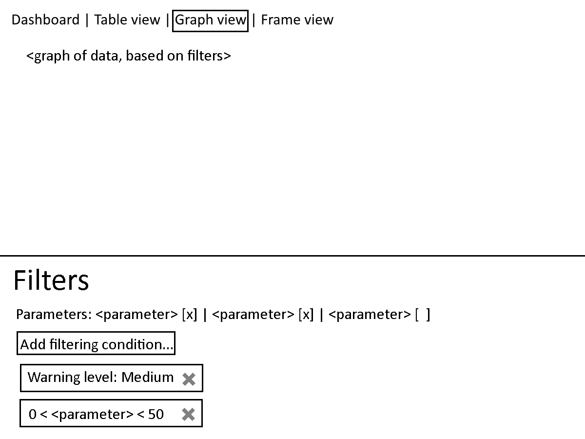
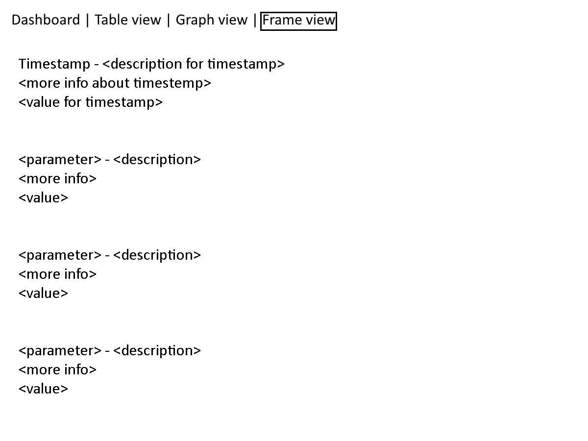
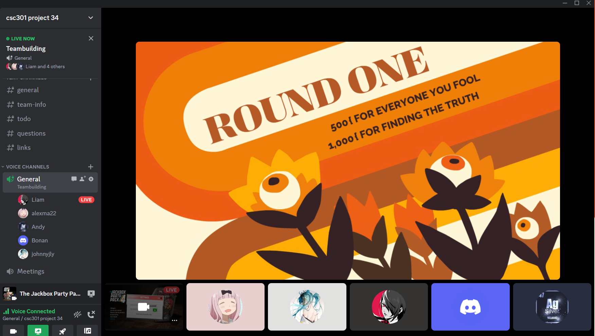
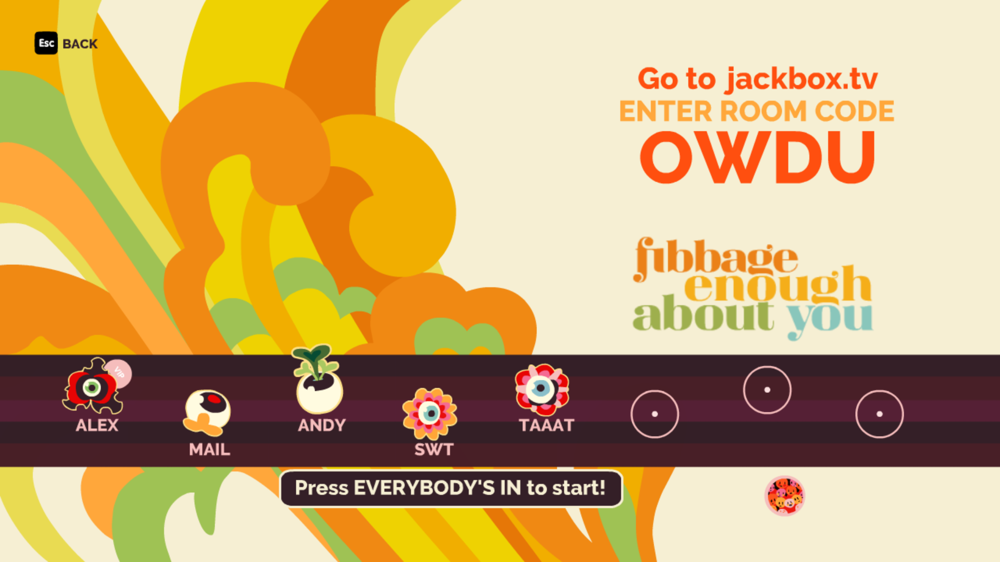

# Astra
> _Note:_ This document will evolve throughout your project. You commit regularly to this file while working on the project (especially edits/additions/deletions to the _Highlights_ section). 
 > **This document will serve as a master plan between your team, your partner and your TA.**

## Product Details
 
#### Q1: What is the product?

**Astra** will be a local, GUI-based program that will allow QEYnet employees and customers to read and interact with data from QEYnet satellites and other devices. QEYnet is a startup company aiming to deploy a quantum key distribution system using satellites. Users will be able to use our app to monitor satellite health by displaying plots of health data over time, and notifying users in case there are any unexpected discrepancies so that they can diagnose and treat any potential problems.

    
    
    
    

#### Q2: Who are your target users?

This app will be targeted towards QEYnet engineers who need to perform live satellite monitoring as well as customers using QEYnet services.

#### Q3: Why would your users choose your product? What are they using today to solve their problem/need?

Satellites out of view are critical to QEYnet’s mission, hence they need some form of software that allows them and customers to monitor the state of their satellites at all times. Our application will give employees a convenient and smooth GUI to check satellite data and keep them informed on satellite health through the use of notifications. 

Our application also allows the users to filter the data with certain attributes among a specific block of data, and generate the plots. Instead of reading large pieces of data with all attributes altogether, this allows the users to find the most informative data and discover new information. 

Additionally, QEYnet has 6 to 8 daily contacts with their satellite, and some of them usually happen at midnight. If we have time to implement it, our application could help to check the status of satellites or communicate to the users at those times, and flag warnings to the satellite coordinator if any discrepancies are noticed. This allows the users to make sure everything is working under control all the time.

#### Q4: What are the user stories that make up the Minumum Viable Product (MVP)?

<table>
    <thead>
    <tr>
        <th>Role</th>
        <th>Action</th>
        <th>Benefit</th>
        <th>Acceptance criteria</th>
    </tr>
    </thead>
    <tbody>
    <tr>
        <td rowspan=8>QEYnet staff and staff of QEYnet’s customers who need to perform monitoring for a satellite /
            other device – both during deployment and for testing/verification purposes
        </td>
        <td>Read in custom telemetry files</td>
        <td>Let the program "see" new data regarding the device</td>
        <td>The user can upload a local file from their computer and have the information accessible to the program.
            If there are problems with the file, the upload does not go through and the user is shown an error.
        </td>
    </tr>
    <tr>
        <td>See the current status/operating mode of the device</td>
        <td>Have quick, easy access to the most important information</td>
        <td>In just a few clicks, the user can see every major piece of broad information about the device.
            The information is correct and up-to-date relative to the data known to the program.
        </td>
    </tr>
    <tr>
        <td>View telemetry data</td>
        <td>Have access to all information inputted into the program</td>
        <td>A table containing the data accessible to the program, spanning multiple telemetry frames,
            is displayed to the user. The user can customize what parameters are displayed for each telemetry frame,
            and sort the table by a specific parameter.
        </td>
    </tr>
    <tr>
        <td>Plot selected parameters against time</td>
        <td>Better understand how specific parameters change over time or easily see outlying data points.</td>
        <td>Data from telemetry frames is plotted on a graph with time as the independent variable
            and various user-chosen parameters as dependent variables.
        </td>
    </tr>
    <tr>
        <td>View data for a chosen telemetry frame</td>
        <td>Focus on data at one specific point in time</td>
        <td>The program keeps track of a number of telemetry frames that the user can select between.
            Doing so displays all data linked to the chosen telemetry frame, along with descriptions of the data.
        </td>
    </tr>
    <tr>
        <td>Apply filters to data</td>
        <td>Focus on a specific subset of the data</td>
        <td>The user can specify and un-specify criteria so that only telemetry frames (if viewing frames)
            / data points (if viewing a graph) that satisfy the specified criteria are displayed.
            Criteria include conditions on values for chosen parameters
            as well as conditions on the alarms that apply to a given frame.
        </td>
    </tr>
    <tr>
        <td>Display warning messages</td>
        <td>Allow staff to know if problems are occurring with a device, especially critical problems</td>
        <td>When unexpected behaviours happen, warnings are displayed on the dashboard, ordered by priority.</td>
    </tr>
    <tr>
        <td>Emit additional warnings for high-priority alarms (if time permits)</td>
        <td>Allow staff to know about critical problems so that they can act on it quickly</td>
        <td>For sufficiently high-priority alarms,
            additional methods of notifying staff are deployed such as popups or emails.
        </td>
    </tr>
    </tbody>
</table>

#### Q5: Have you decided on how you will build it? Share what you know now or tell us the options you are considering.

We will develop a local GUI-based python program. Python aligns with other QEYnet products and it has several powerful scientific libraries like PyQt5, Tkinter, matplotlib, plotly, numpy, scipy and pandas.

In terms of the components of our program, we will have a frontend, backend, and database. 
* Our frontend will be a GUI menu allowing access to all of the satellite information.
* Our backend will need to process data and perform all logic needed for operations. It would communicate relevant data between the frontend and the database.
* Our database will store and allow backend access to data from QEYnet.

----
## Intellectual Property Confidentiality Agreement 

The team can upload the code to GitHub or other similar publicly available domains.

The team has the responsibility to keep all the data and code private during the course.

After the project is completed and fully revised by the partner, the team can share the code under an open-source license and distribute it as they wish.

----

## Teamwork Details

#### Q6: Have you met with your team?

We had two meetings with the team on our Discord channel, briefly introducing ourselves and discussing the overview of the project.

We also played some online games on Jackbox, including Gartic Phone and etc.

    
    

**Fun Facts**:
* Coincidentally 2 of us live very close.
* We also have 2 piano players.
* One team member has published a personal project on GitHub before.

#### Q7: What are the roles & responsibilities on the team?

|Name|Roles|
|------|---|
|Andy|Frontend help Database (taking CSC343)|
|Johnny|Frontend/GUI help (taking CSC309 / interested in PyQt/Tkinter stuff) Database (CSC343)|
|Bonan|Product manager Dedicated partner liaison Frontend help (taking CSC318) Backend - data processing logic (have experience with NumPy and pandas)|
|Alex|Development manager, feel somewhat experienced with it from my part in CSC207. Backend, My primary experience area.|
|Liam|Backend - database (taking CSC343, interested in gaining experience)|
|Albert|Frontend/GUI help (taking CSC309)|

#### Q8: How will you work as a team?

We plan to have two meetings every week (one on Zoom at Thursday tutorial, and the other one on Friday on Discord if needed).

The purpose of each meeting would be a team report of the weekly progress, discussions of the project details and future plans. We will also use meetings to perform synchronous collaborative work as needed.

Additionally, We will have a partner meeting with the team leader (and optionally other team members) once a week on Monday at 11 AM.

**Meeting 1**:

Saturday, Sept 23, 13:00-13:55
* Partner explained in greater depth the goals of QEYnet and how the team's project fits in
* Project will be a local GUI application with local file I/O
* Partner shared example types of data that will be processed by the project
* For the project, functionality and usability are to be prioritized over visual aesthetics
* Team will be working in the team repository, not a repository of QEYnet
* Partner will be providing support regarding the requirements of the project, but not regarding the code of the project
* Team may make source code public after the completion of the project
* The team repository is to be kept private until the completion of the project, as the code may contain confidential information that will need to be removed before public release
* Project Expectations and Code of Conduct document was brought up, but not explicitly reviewed
* To do: set up a file-sharing hub for the project separate from source control
* Next meeting: Tue, Sept 26, 18:30 to evaluate an initial mockup for the project design
* Schedule for regular meetings will be determined in the next meeting

**Meeting 2**:

Tuesday, Sep 26, 18:30-19:20

* Team presented initial mockups to the partner
* Team presented initial user stories to the partner – to be revised and presented again approval before the D1 deadline
* Team asked clarifying questions about the project
* Partner presented and explained an example configuration file for the project
* Regular meetings will occur every Monday at 11:00 (decided shortly before the meeting)

  
#### Q9: How will you organize your team?

We use the Discord events feature in our server to schedule and keep each other informed about group meetings and partner meetings. Also, we have a channel in Discord dedicated to a TODO list, and plan on using our GitHub repository’s issue tab for more specific coding plans. Tasks are generally voluntarily self-assigned based on the domain of the task and workload. We plan on discussing and updating each other on the progress toward the completion of specific tasks during our meetings.

#### Q10: What are the rules regarding how your team works?

**Communications:**

Discord is our primary method of communication and asynchronous collaboration. Other than that, we also meet every Thursday tutorial, and on Fridays as needed.

We will have a partner meeting with the team leader (and optionally other team members) once a week on Monday. We can additionally ask small questions through discord.

 
**Collaboration:**

We will rely on our coordinators to make sure everyone is on task and not lagging behind, and they will be able to inform the group in case we need to step in and help someone catch up. 

Members who cannot make it to a meeting, or who cannot complete a task in time, should inform the team beforehand. These matters should be handled on a case-by-case basis.

When a member cannot complete a task on time, we should try to handle this internally with some kind of intervention or maybe cutting back on workload.

As a last resort, we may need to escalate matters by bringing it up with our TA.

